# Travel
## Taiwan and Japan
### January 8th, 2025
On the map, I could see the Keelung River near my hotel, but I hadn't seen it in person, so I set off walking in that direction. I soon came to a park running alongside it, which lent some nice views of the city.

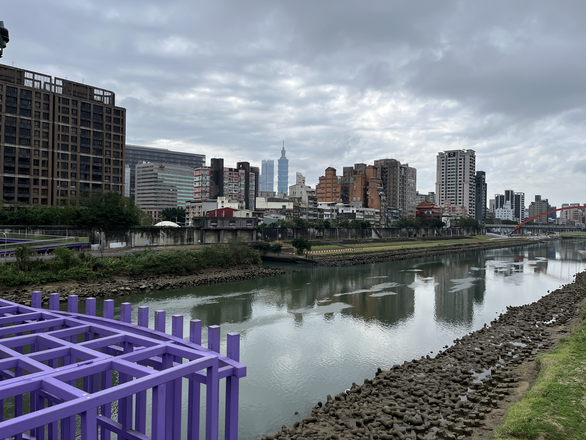

Then starting to get hungry, I grabbed a lunch of shrimp dumplings, pickled cucumber, and soup, before heading to Zhongshan Park where a zigzagging bridge runs over the water leading to the Tsuei Heng Pagoda.

I then took the metro to Shilin, where Sean and I met up and got dinner at a night market. I tried a Taiwanese pancake and various vegetable and seafood skewers. As we were leaving, Sean told me that several of the metro stops are connected underground by tunnels lined with shops, so we walked the length of one stop, where we passed a synchronized dance practice.

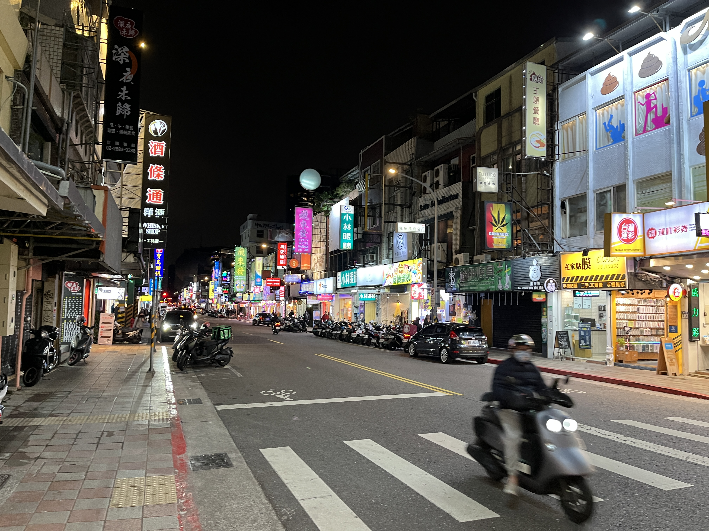

I'd also noticed that an excerpt from Chopin's Nocturne Op. 9 No. 2 would play in the station and conclude exactly as the metro pulls in. Sean explained each metro line has its own accompanying music, so we listened to several of them as well.  To end the night, we grabbed cocktails, which were very similar to those in the US, but still very good.

### January 7th, 2025
In the morning, I took the metro to the mountainous Beitou district for a visit to its famous hot springs. I had lunch next to the Beitou public library overlooking a stream below, and then headed to a spring.

The one I visited does not allow photography, but has four pools ranging in temperature from lukewarm to scalding. I found the second hottest very relaxing, but couldn't stay in the hottest for long. Walking back to the station, a passerby on the street asked if I speak English and if I could explain how the lockers at the hot spring work, so I helped him out.

After getting back downtown, I headed towards Taipei 101 and bought a ticket to the observatory spanning floors 89 and 91. The elevator ride took 37 seconds going up, and 45 going down (it needs to be slower going down; with gravity's help, it wouldn't be able to stop otherwise). The views of the city really were spectacular, and very jarring to see just how much the 101 dwarfs the rest of the city.

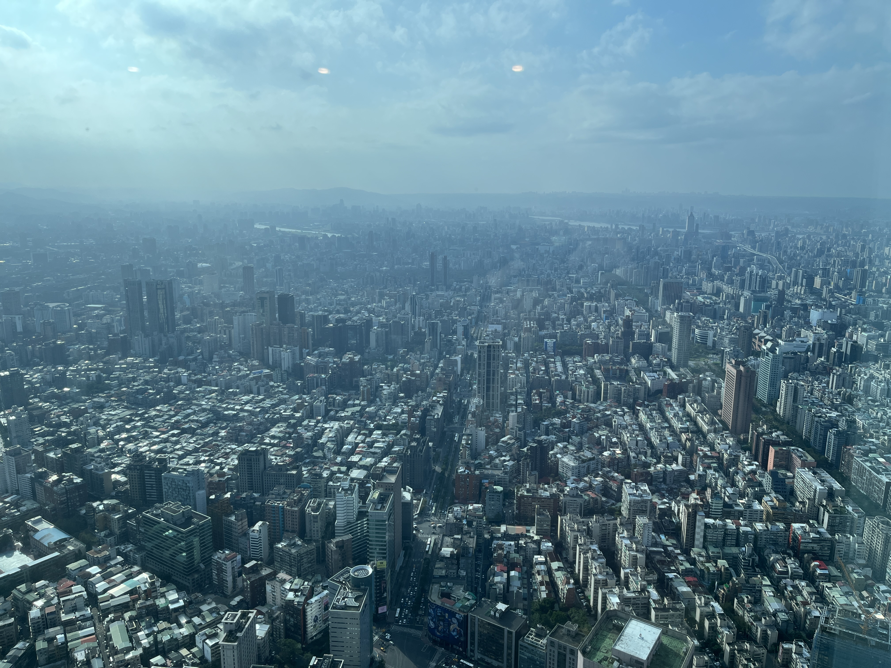

It was also interesting to see places I'd been previously from a new perspective. In particular, the Sun Yat-sen memorial and the Taipei dome.

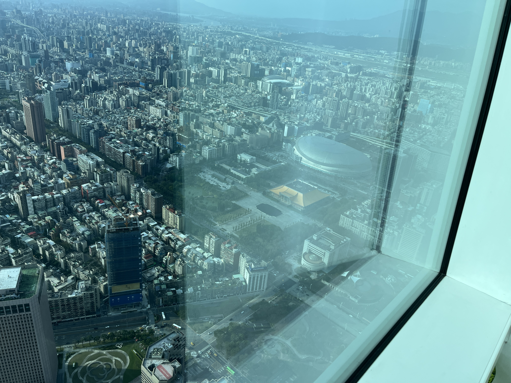

Circling around the observatory to the eastern side, you can also see the mountains and the city struggling to encroach on to them.

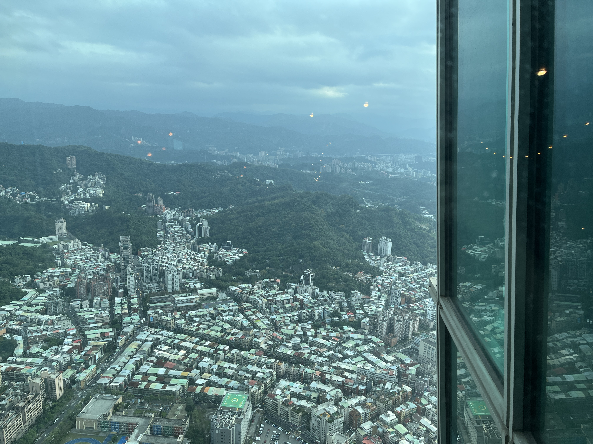

Returning to the ground, I enjoyed some shrimp fried rice with mushrooms, soup, and tea in the food court before heading back to my hotel for the evening.

### January 6th, 2025
Sean went with his parents for a short trip to Tainan until the 8th, so I decided to visit the Taipei zoo. Right after the entrance was a pond with many flamingos balancing on one leg.

Then walking through the tropical rainforest section, containing lorises, toucans, a sloth, orangutans, and more, I came to the elephant section, who were mostly turned away eating while I was there.

In the immediate next pen though was a tiger, constantly pacing back and forth along the edge of its pen. I then passed through the desert and African sections, seeing camels (one of which rolled onto its side while I watched), giraffes, and rhinos.

Then I went through the reptiles and amphibians exhibit, which included a golden axolotl, and finally the penguin exhibit.

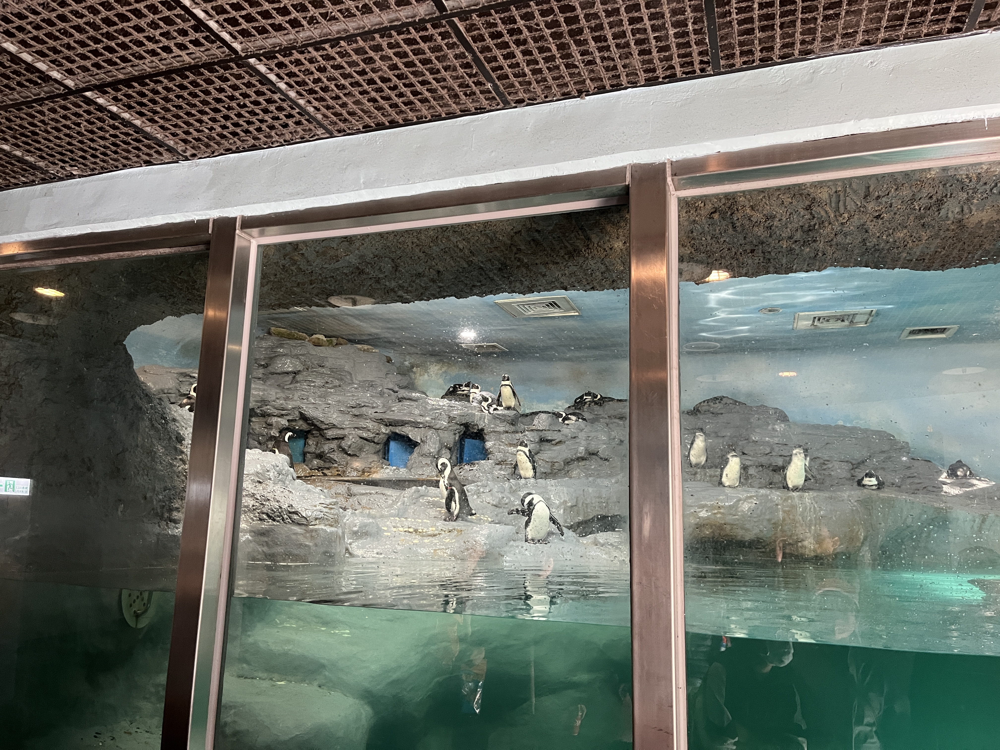

After that, I headed out of the zoo and picked up two sandwiches from FamilyMart, one with mustard, egg, and cheese, and the other with strawberry jam on a hot dog roll. I was planning to visit the top of Taipei 101 in the evening, but it was pretty cloudy, and it was already dark by the time I reached it.

I ended up just wandering around the five lowest floors, before picking up some spicy seafood cup noodles, and checking in early for the night.

### January 5th, 2025
Determined to figure out what it was, I began my morning by walking towards the recently opened Taipei dome, which turned out to be a massive baseball stadium with shops and restaurants lining its perimeter. Being in the area, I also wandered next door to the Songshan Creative Park where I relaxed, admiring a spectrum of koi fish swimming in a pond. I also went across the street the Sun Yat-sen Memorial Hall, but found it closed last year for renovations expected to be completed in 2026.

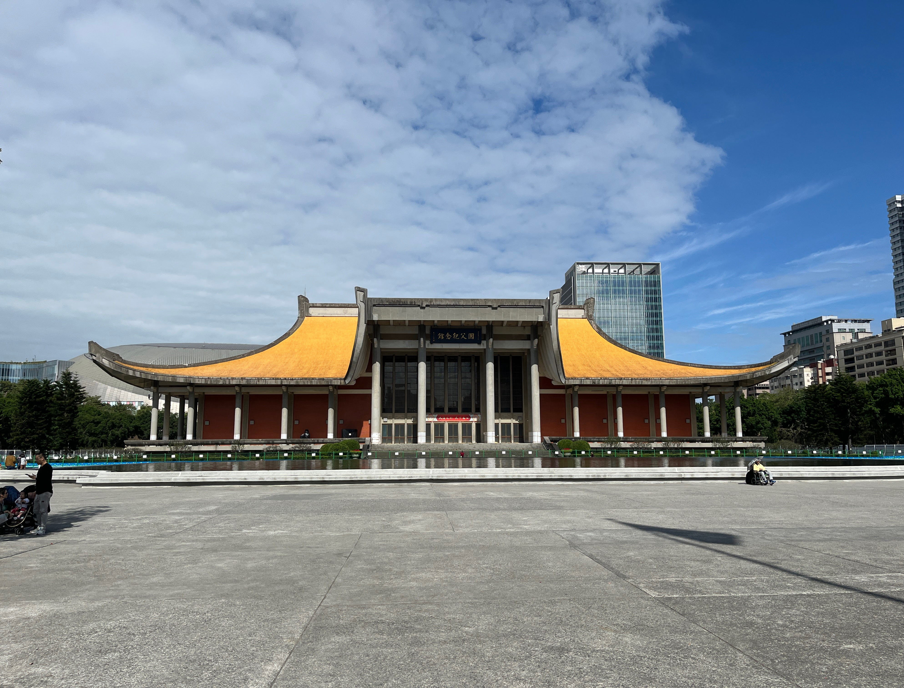

I met up with Sean outside the memorial before heading to lunch: an elaborate meal including cabbage, oysters, fried mushrooms, barley rice, beans, radish, soup, and Japanese drinking vinegar. With our bellies full, we took the metro to the Taipei Confucius Temple, now converted into a museum but still very beautiful.

We then went across the street to the Dalongdong Baoan Temple, which in contrast is still very much in use. Upon entering, we were overwhelmed by the smell of smoke and a huge crowd of people carrying incense. Climbing up to the fourth floor, we could see the beautiful ornate roofs of the levels below.

We then took the metro to the Tamsui district at the very end of the red line, and walked along the river to where it meets the ocean at Shalun beach. Along the way, we happened to randomly encounter one of Sean's high school friends there with his parents.

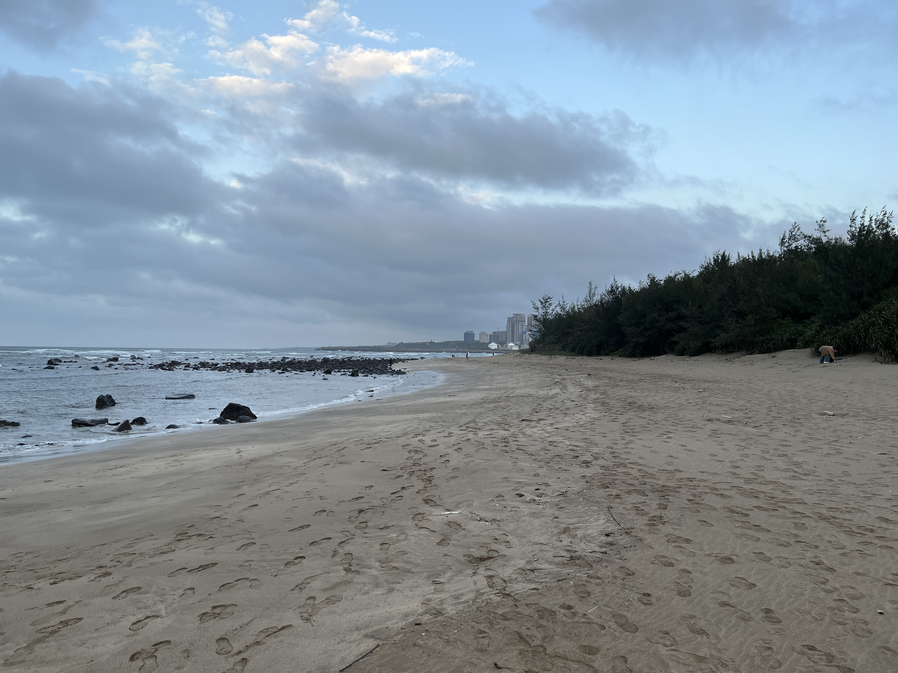

For dinner, we went to the crowded Raohe Street Night Market, only a block from my hotel, where I tried rice noodles, tofu, guava, and aiyu jelly, plus shaved ice for dessert.

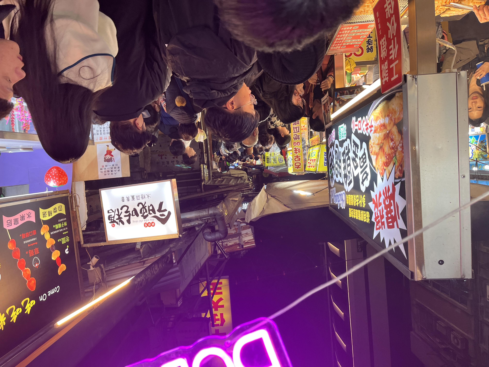

### January 4th, 2025
After waking up, I walked toward Taipei 101 and wandered around some nearby parks and outdoor malls while waiting for Sean to arrive via the metro. While doing so, I spotted a festive reindeer-dragon hybrid.

After we met up, he took me to a food court where I ate some Japanese curry, chrysanthemum tea, and picked up some bread by his recommendation for later. After eating, we walked to Elephant Mountain and started our ascent up a seemingly endless winding of stone stairs. The views of the city were well worth the climb!

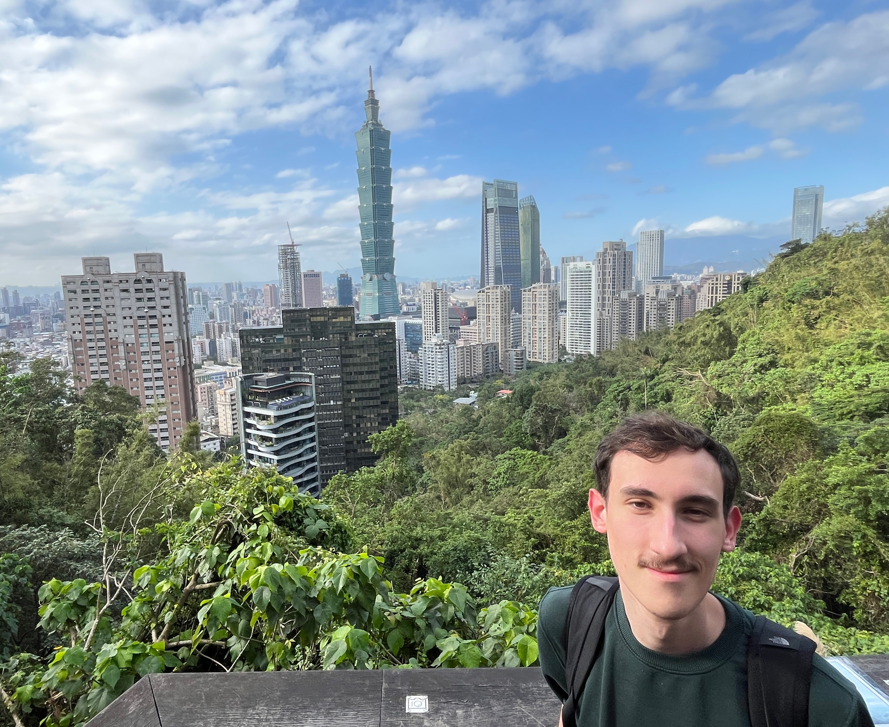

After coming back down, Sean gave me a Taipei metro crash course as we made our way to the very impressive Chiang Kai-shek memorial. We accidentally arrived at 4:00pm, just in time to witness the changing of the guard ceremony before perusing the museum inside.

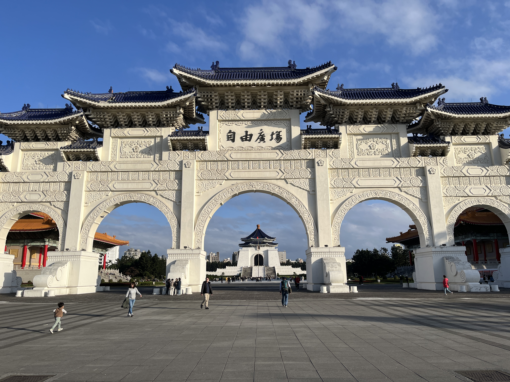

Next, we walked to the nearby 228 peace memorial park and passed the presidential office building on the way towards Ximending, a very busy neighborhood crammed with shops and neon lights. While there, I picked up a Yakult flavor I'd never seen in the US, and a Taiwanese beer recommended by Sean. We also stopped in a cat café, which was surprisingly serene given the volume just on the other side of the window.

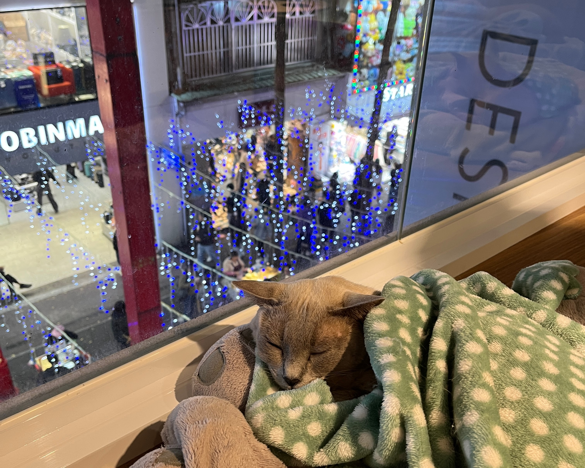

I also enjoyed some "stinky tofu" from a vendor on the street, only to witness several of such vendors being chased away by the police as we were leaving Ximending minutes later. On the way back towards Songshan, we stopped by Huashan 1914 Creative Park, a former wine factory during Japanese rule, now converted into stalls for pop-up shops. Finally, I said goodbye to Sean for the night, and tested myself by taking the metro back to the hotel, where I enjoyed the bread and beer I picked up earlier, and ended the day with a nice hot bath.
